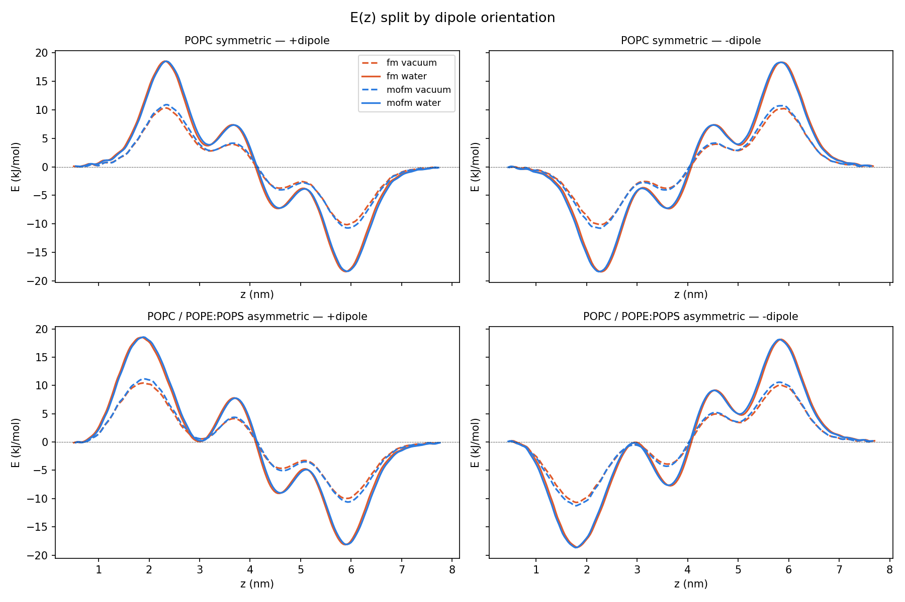

# Gallery

Each subdirectory contains a self-contained submission script and protocol for one
scientific use case.

## Subdirectories

| Directory | WorkChain | System |
|---|---|---|
| `01_popc_symmetric/` | `MembraneElectrostaticsWorkChain` | Symmetric POPC bilayer (256 lipids/leaflet, 1 µs) |
| `02_popc_pope_pops_asymmetric/` | `MembraneElectrostaticsWorkChain` | Asymmetric POPC outer / POPE:POPS 3:1 inner bilayer (1 µs) |
| `03_fm_resp_charges/` | `MoleculeChargeDistributionWorkChain` | fm (C₂₂H₁₆F₃NO₃S) — RESP charges in vacuum and CPCM water |
| `04_mofm_resp_charges/` | `MoleculeChargeDistributionWorkChain` | mofm (C₂₃H₁₈F₃NO₄S) — RESP charges in vacuum and CPCM water |

## Combined result

`ez_fm_mofm_by_orient.png` shows the electrostatic interaction energy E(z) for fm and
mofm against both membranes (galleries 01–04 combined).  Rows: POPC symmetric (top) and
POPC/POPE:POPS asymmetric (bottom).  Columns: +dipole and −dipole orientation.
Line colour encodes molecule (red = fm, blue = mofm); line style encodes solvent
(solid = CPCM water, dashed = vacuum).

