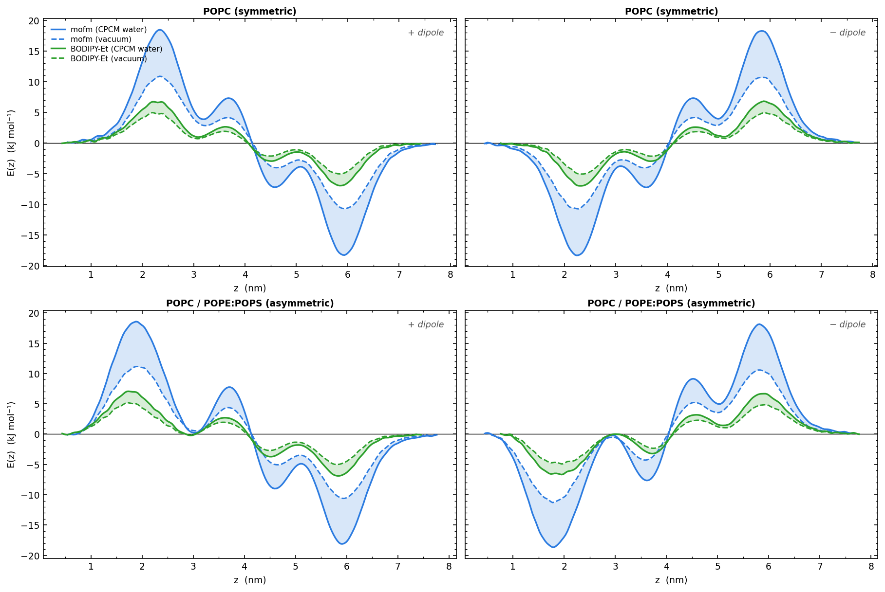

# Gallery

Each subdirectory contains a self-contained submission script and protocol for one
scientific use case.

## Subdirectories

| Directory | WorkChain | System |
|---|---|---|
| `01_popc_symmetric/` | `MembraneElectrostaticsWorkChain` | Symmetric POPC bilayer (256 lipids/leaflet, 1 µs) |
| `02_popc_pope_pops_asymmetric/` | `MembraneElectrostaticsWorkChain` | Asymmetric POPC outer / POPE:POPS 3:1 inner bilayer (1 µs) |
| `03_fm_resp_charges/` | `MoleculeChargeDistributionWorkChain` | fm (C₂₂H₁₆F₃NO₃S) — RESP charges in vacuum and CPCM water |
| `04_mofm_resp_charges/` | `MoleculeChargeDistributionWorkChain` | mofm (C₂₃H₁₈F₃NO₄S) — RESP charges in vacuum and CPCM water |
| `05_bodipyet_resp_charges/` | `MoleculeChargeDistributionWorkChain` | BODIPY-Et (C₂₁H₂₃BF₂N₂) — neutral fluorescent dye, negative control |

## Electrostatic summary

Dipole moments and minimum E(z) interaction energies from `ElectrostaticEnergyWorkChain`.
Energies in kJ mol⁻¹; +dip and −dip refer to the two dipole orientations relative to the
membrane normal.  fm is included for completeness; the gallery plot shows mofm only for
clarity.

| Molecule | Solvent | μ (D) | POPC +dip (kJ/mol) | POPC −dip (kJ/mol) | Asym +dip (kJ/mol) | Asym −dip (kJ/mol) |
|---|---|---:|---:|---:|---:|---:|
| fm | vacuum | 11.4 | −10.1 | −10.1 | −10.0 | −10.7 |
| fm | CPCM water | 19.3 | −18.3 | −18.4 | −18.2 | −18.6 |
| mofm | vacuum | 12.1 | −10.7 | −10.7 | −10.6 | −11.3 |
| mofm | CPCM water | 19.5 | −18.3 | −18.4 | −18.1 | −18.7 |
| BODIPY-Et | vacuum | 5.1 | −5.0 | −5.1 | −5.0 | −4.9 |
| BODIPY-Et | CPCM water | 7.0 | −7.0 | −7.0 | −6.9 | −6.7 |

## Combined result

`ez_mofm_bodipyet_by_orient.png` shows the electrostatic interaction energy E(z) for
mofm (mitochondria-targeting) and BODIPY-Et (neutral negative control) against both
membranes (galleries 01–02 and 04–05 combined).  fm is omitted for clarity; its profile
closely tracks mofm.  Rows: POPC symmetric (top) and POPC/POPE:POPS asymmetric (bottom).
Columns: +dipole and −dipole orientation.  Line colour encodes molecule (blue = mofm,
green = BODIPY-Et); line style encodes solvent (solid = CPCM water, dashed = vacuum).

